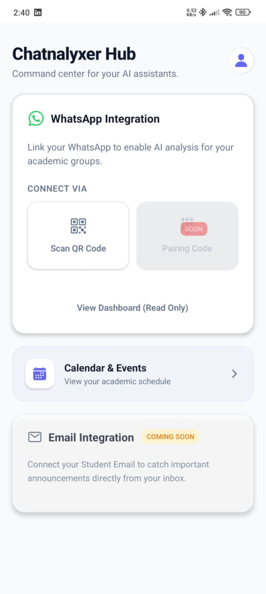
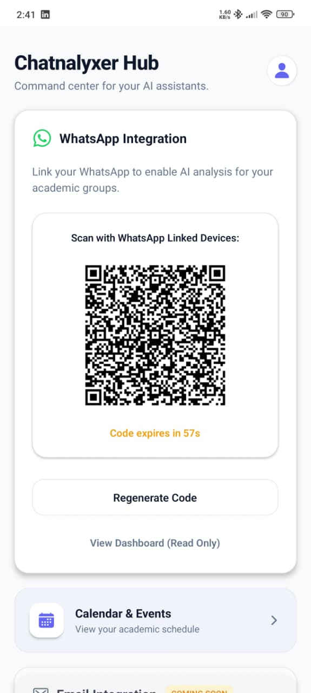
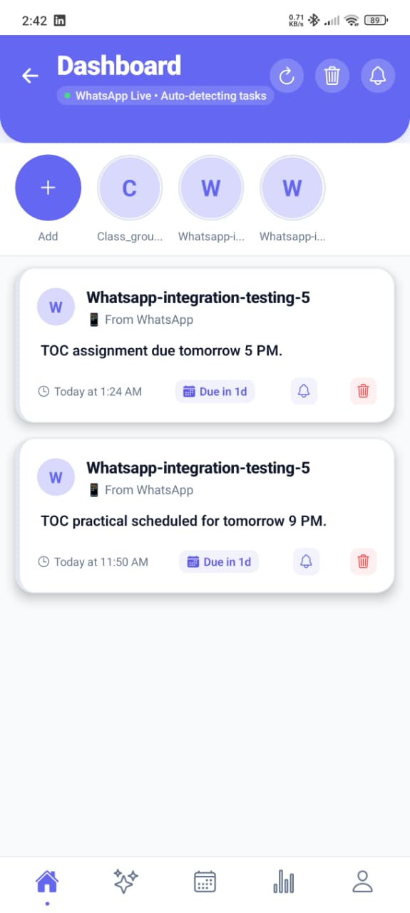
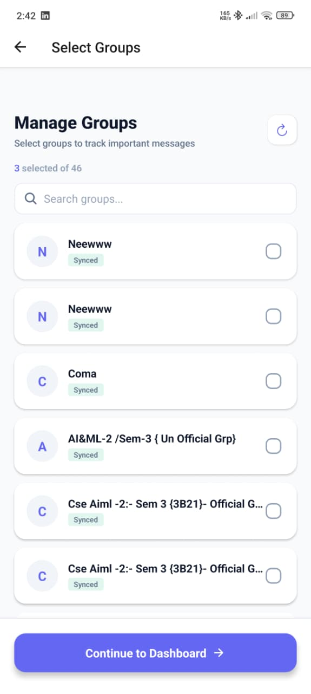
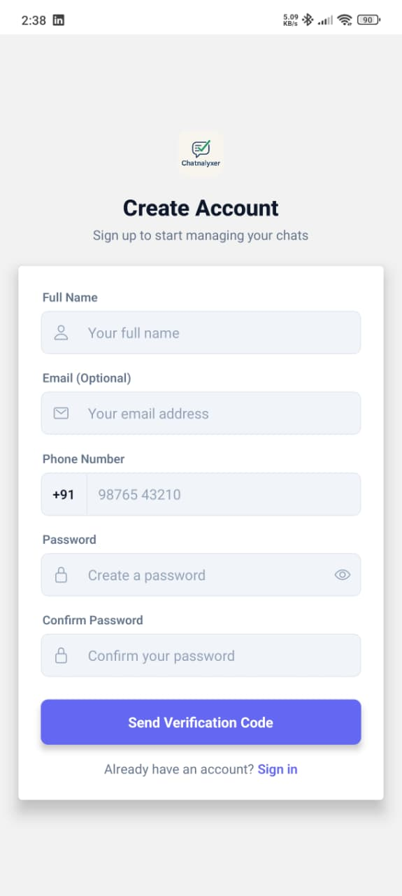
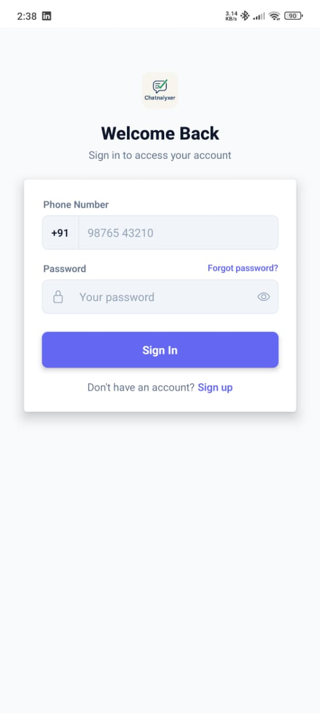

::: center
[[CHATNALYXER]{.smallcaps}]{style="color: purple"}\
[AI-Powered Academic Message Classification and Smart Reminder
System]{style="color: purple"}\
**A Project Report**\
Submitted By\
[**Duggina Yaswanth Chowdary**]{style="color: olive"}\
2303031460043\
[**Pamula Rahul**]{style="color: olive"}\
2303031460145\
[**Kyatham Aishwarya**]{style="color: olive"}\
2303031460102\
[**Mahira Syed**]{style="color: olive"}\
2303031460107\
in Partial Fulfilment for the Award of\
the Degree of\
**BACHELOR OF TECHNOLOGY**\
COMPUTER SCIENCE & ENGINEERING (AIML)\
Under the Guidance of\
**Prof. Ritu Agrawal**\
Professor\
**Prof. Jaswanth Parlapalli**\
Assistant Professor\
\
\
**PARUL UNIVERSITY**\
VADODARA\
April -- 2026
:::

<figure data-latex-placement="h">

</figure>

::: center
[PARUL UNIVERSITY]{.smallcaps}\
**CERTIFICATE**\
:::

This is to certify that Project - 1 (303105300) of 6$^{th}$ Semester
entitled

::: center
**"Chatnalyxer: AI-Powered Academic Message Classification and Smart
Reminder System"**
:::

of Group No. PIET_AIML_16 has been successfully completed by

- **Duggina Yaswanth Chowdary -- 2303031460043**

- **Kyatham Aishwarya -- 2303031460102**

- **Pamula Rahul -- 2303031460145**

- **Mahira Syed -- 2303031460107**

under our guidance in partial fulfillment of the Bachelor of Technology
(B.Tech) in Computer Science & Engineering of Parul University in
Academic Year 2025--2026.

Date of Submission : \_\_\_\_\_\_\_\_\_\_\_\_\_\_\_\_\_\_

  ------------------------------- ------------------------
  **Prof. Ritu Agrawal**          **Dr. Kamal Sutaria**
  Project Guide                   Head of Department
  **Prof. Jaswanth Parlapalli**   **Prof. Ritu Agrawal**
  Project Guide                   Project Co-ordinator
  ------------------------------- ------------------------

::: center
**Acknowledgements**
:::

We would like to thank **Dr. Kamal Sutaria**, Head of the Department of
CSE-AIML at Parul University, for providing us with the facilities,
resources, and a supportive academic environment that helped us complete
this project successfully.

We are very grateful to **Prof. Ritu Agrawal**, Professor in the
Department of CSE-AIML, for her constant guidance, support, and valuable
suggestions throughout the project. Her help played an important role in
improving our ideas, design, and overall work.

We would also like to sincerely thank **Prof. Jaswanth Parlapalli** and
other faculty members for their continuous support and helpful technical
guidance. Their advice helped us understand concepts better and improve
our project work.

We also thank the Department of CSE-AIML, Parul University, for giving
us access to the tools, technologies, and learning resources needed to
complete this project.

This project has been a great learning experience for us, where we got
the chance to apply our knowledge of Artificial Intelligence, Machine
Learning, Natural Language Processing, and system design to solve a
real-world problem.

::: flushright
**Duggina Yaswanth Chowdary -- 2303031460043**\
**Kyatham Aishwarya -- 2303031460102**\
**Pamula Rahul -- 2303031460145**\
**Mahira Syed -- 2303031460107**\
CSE-AIML, PIET\
Parul University,\
Vadodara
:::

::: center
**Abstract**
:::

In today's academic environment, students and faculty are overwhelmed by
the constant flood of messages on platforms like WhatsApp and email,
where critical information such as exam schedules, assignment deadlines,
event announcements, and meeting alerts often gets buried under casual
conversations, making it easy to miss important updates. This project
presents **Chatnalyxer**, an AI-powered academic message classification
and smart reminder system designed to automatically capture messages
from selected academic groups, analyze them using Natural Language
Processing (NLP), and extract key details such as deadlines, exam dates,
and announcements. The system organizes this information into a
structured interface and sends intelligent, customizable reminders. By
converting unstructured conversational data into actionable insights,
Chatnalyxer reduces stress, improves academic planning, and ensures that
no important task is overlooked. The system has been implemented as a
minimum viable product using a multi-layered architecture that includes
real-time message ingestion, an AI/NLP processing engine, a secure
database, and a notification scheduler. Experimental results demonstrate
high accuracy in message classification and deadline extraction, with
users reporting improved time management and reduced missed deadlines.
Chatnalyxer provides a novel solution tailored specifically to the
academic communication domain, addressing a gap that existing
general-purpose tools fail to fill.

**Keywords:** Natural Language Processing, Artificial Intelligence,
Academic Communication, Message Classification, Deadline Extraction,
Smart Reminders, WhatsApp Integration

# Introduction

## Background and Motivation

The proliferation of digital communication platforms has transformed the
way academic institutions share information. WhatsApp, in particular,
has become a primary channel for class groups, faculty announcements,
and peer discussions \[5\],\[18\]. According to a 2023 survey by the
International Journal of Educational Technology, over 85% of university
students in India use WhatsApp for academic communication. While these
platforms offer convenience, they also create an overwhelming flood of
unstructured information. Students often find themselves scrolling
through hundreds of messages to locate a single deadline or exam
schedule. Important announcements are frequently buried under memes,
emojis, and casual chats \[18\]. This problem is exacerbated during peak
academic periods such as exams and project submissions; a study reported
that 67% of students missed at least one academic deadline due to
information overload on messaging platforms \[7\]. The absence of
intelligent filtering and prioritization tools means students must
manually monitor their groups, a time-consuming and error-prone process.
Existing reminder and calendar applications require manual input, adding
to the student's workload rather than reducing it \[4\].

## Problem Definition

The core problem addressed by Chatnalyxer is the lack of an automated,
intelligent system that can operate continuously across academic
WhatsApp groups and email in real time \[9\]; distinguish academically
relevant messages from casual conversation; and extract structured
information---deadlines, exam dates, meeting times, event details---from
unstructured text \[12\]. It must interpret contextual language such as
"submit tomorrow" or "project review at 3 PM" to determine exact
deadlines \[21\]. The system then generates timely, multi-level
reminders based on urgency and priority, presents all extracted
information in a unified dashboard and calendar, and ensures privacy by
processing only selected groups while discarding raw chat data after
analysis \[3\],\[16\]. Chatnalyxer aims to turn messy academic
conversations into a structured, actionable system, reducing missed
deadlines and improving academic time management.

## Objectives and Key Contributions

The primary objective of Chatnalyxer is to design and implement a
robust, AI-based academic message management system \[2\]. Specific
objectives include high accuracy in classifying messages as academic or
non-academic, extracting deadlines/events/announcements with minimal
user intervention, and providing real-time monitoring of selected
WhatsApp groups and email accounts \[6\],\[14\]. It also targets
intelligent, customizable reminders with escalation logic; intuitive
dashboards/calendars; and strict privacy by processing only authorized
groups while discarding raw data \[11\]. Key contributions:

**Real-Time Message Ingestion:** Continuous monitoring of selected
groups via Baileys WebSocket API without exposing personal conversations
\[8\].

**Academic-Specific NLP Engine:** AI pipeline tuned to recognize
academic intent, extract deadlines, and interpret temporal expressions
common in student communication \[10\].

**Multi-Modal Processing:** Extraction from text, images (OCR), PDFs,
and voice notes so no academic content is overlooked \[15\].

**Intelligent Reminder System:** Hierarchical scheduler that sends
advance alerts, intermediate reminders, and final alarms based on
extracted deadlines and user preferences \[19\].

**Privacy-Preserving Architecture:** Transient handling of raw messages;
only structured, anonymized task data is stored \[13\].

## Scope and Limitations

### Scope

Chatnalyxer focuses on academic communication channels used by students
and faculty \[20\]. Current scope includes real-time monitoring of
WhatsApp groups (Baileys API) and optional email (SMTP/IMAP) for
academic notifications; text, image, PDF, and voice-note processing;
extraction of deadlines, exams, assignments, meetings, and
announcements; user-specific dashboards, calendars, and notification
preferences; and a conversational AI assistant for natural language
interactions \[24\],\[26\].

### Limitations

Current limitations: reliance on a non-official WhatsApp API (Baileys),
which may be subject to platform policy changes \[1\]; English-first NLP
models that need tuning for other languages \[22\]; OCR accuracy depends
on image quality and struggles with handwriting \[23\]; MVP is
local---cloud deployment and large-scale testing are pending \[17\];
voice-note transcription can err in noisy environments \[25\].

# Literature Survey

## WhatsApp Chat Analyzer --- An AI-Based WhatsApp Chat Analysis and Insights System

  **Student Name:**    PAMULA RAHUL
  -------------------- -----------------------------------------------------------------------------------
  **Enrollment No:**   2303031460145
  **Branch:**          CSE (AIML)
  **Title:**           WhatsApp Chat Analyzer --- An AI-Based WhatsApp Chat Analysis and Insights System
  **Authors:**         Mayank Chudasama, Kalpesh Chudasama

**Abstract:** Proposes a privacy-preserving analyzer for exported
WhatsApp chats that runs sentiment analysis, topic modeling,
summarization, and abuse detection while masking identifiers. Reports
 85% F1 on sentiment and  88% on abuse detection. Emphasizes
anonymization, opt-in consent, and secure handling of conversational
data to maintain user trust while delivering actionable insights.

## WhatsApp Chat Analyzer Using Python

  **Student Name:**    PAMULA RAHUL
  -------------------- -------------------------------------------------------------
  **Enrollment No:**   2303031460145
  **Branch:**          CSE (AIML)
  **Title:**           WhatsApp Chat Analyzer
  **Authors:**         Divyansh Seksaria, Hritik Lohiya, Maruf Khan, Bhawana Booti

**Abstract:** Builds a Python pipeline to extract message frequency,
user activity, sentiment polarity, and keyphrase trends. Adds
personalized recommendations using collaborative filtering to surface
important contacts and topics. Highlights lightweight deployment and
reproducible notebooks for rapid experimentation on new chat exports.

## WhatsApp Chat Analysis Based on NLP Using Machine Learning

  **Student Name:**    PAMULA RAHUL
  -------------------- -----------------------------------------------------------------------
  **Enrollment No:**   2303031460145
  **Branch:**          CSE (AIML)
  **Title:**           WhatsApp Chat Analysis Based on NLP Using Machine Learning
  **Authors:**         Dhanashri Hase, Junaid Khan, Sahil Khot, Rehaan Qureshi, Firoz Shaikh

**Abstract:** Applies tokenization, stopword removal, lemmatization,
sentiment classification, topic modeling, and NER to exported chats.
Demonstrates improved relevance scoring when combining TF--IDF with
topic distributions for downstream search. Notes challenges with
code-mixed Hinglish and proposes incremental retraining to adapt
vocabularies.

## WhatsApp Chat Analyzer (Visualization-Based System)

  **Student Name:**    PAMULA RAHUL
  -------------------- ----------------------------------------------------------
  **Enrollment No:**   2303031460145
  **Branch:**          CSE (AIML)
  **Title:**           WhatsApp Chat Analyzer
  **Authors:**         Faculty and Students of Srinivas Institute of Technology

**Abstract:** Focuses on visual analytics: time-series of activity,
per-user heatmaps, word clouds, and burst detection to reveal
conversation peaks. Implements a Flutter/Python stack with upload,
preprocessing, and browser-based charting. Shows how visual summaries
reduce manual scrolling and help pinpoint high-information intervals.

## WhatsApp Chat Analysis and Spam Message Detection

  **Student Name:**    PAMULA RAHUL
  -------------------- ---------------------------------------------------
  **Enrollment No:**   2303031460145
  **Branch:**          CSE (AIML)
  **Title:**           WhatsApp Chat Analysis and Spam Message Detection
  **Authors:**         Not specified

**Abstract:** Benchmarks Naive Bayes, SVM, and Maximum Entropy on
labeled chat spam; SVM reaches  98% accuracy. Introduces n-gram and
character-level features to handle obfuscated spam, and suggests
incremental learning to keep pace with evolving spam templates.

## Content Analysis of WhatsApp Conversations

  **Student Name:**    YASWANTH CHOWDARY DUGGINA
  -------------------- --------------------------------------------
  **Enrollment No:**   2303031460043
  **Branch:**          CSE (AIML)
  **Title:**           Content Analysis of WhatsApp Conversations
  **Authors:**         Sana Shahid

**Abstract:** Studies frequency, lexical richness, and media sharing
across student and professional cohorts. Finds students post more
frequently with shorter, informal messages and higher emoji density.
Concludes that temporal patterns (late-night bursts) correlate with
missed announcements.

## WhatsApp Chat Analyzer (IRJET Study)

  **Student Name:**    YASWANTH CHOWDARY DUGGINA
  -------------------- ---------------------------
  **Enrollment No:**   2303031460043
  **Branch:**          CSE (AIML)
  **Title:**           WhatsApp Chat Analyzer
  **Authors:**         Not specified

**Abstract:** Python-based parser that tokenizes chats, builds activity
timelines, and computes per-user participation scores. Highlights the
importance of cleaning system messages and normalizing timestamps for
cross-timezone groups.

## WhatsApp Chat Analysis and Visualization

  **Student Name:**    YASWANTH CHOWDARY DUGGINA
  -------------------- ----------------------------------------------------------------------------
  **Enrollment No:**   2303031460043
  **Branch:**          CSE (AIML)
  **Title:**           WhatsApp Chat Analysis and Visualization
  **Authors:**         Farzana Khan, Farooq Shaikh, Rohan Shirke, Raj Manjrekar, Aakash Kumar Jha

**Abstract:** Generates timelines, user-activity bars, and word clouds
from uploaded chat files. Demonstrates how visual cues expose silent
periods, dominant speakers, and topic shifts faster than raw text
review.

## NLP-Based Mental Health Analysis Using WhatsApp Chat

  **Student Name:**    YASWANTH CHOWDARY DUGGINA
  -------------------- ------------------------------------------------------
  **Enrollment No:**   2303031460043
  **Branch:**          CSE (AIML)
  **Title:**           NLP-Based Mental Health Analysis Using WhatsApp Chat
  **Authors:**         Dr. Manoj Kumar, Shreshth Aggarwal

**Abstract:** Applies sentiment trajectories, LIWC-style categories, and
frequency of negative affect terms to infer emotional trends. Suggests
early-warning signals for distress but warns about privacy, consent, and
false positives.

## WhatsApp Chat Analyzer Using Machine Learning Techniques

  **Student Name:**    PAMULA RAHUL
  -------------------- ----------------------------------------------------------
  **Enrollment No:**   2303031460145
  **Branch:**          CSE (AIML)
  **Title:**           WhatsApp Chat Analyzer Using Machine Learning Techniques
  **Authors:**         Not specified

**Abstract:** Experiments with classic ML (SVM, RF) versus lightweight
transformers for message classification. Finds hybrids of TF--IDF plus
small transformers balance speed and accuracy for on-device use.

## Multi-Participant Chat Analysis

  **Student Name:**    MAHIRA SYED
  -------------------- ---------------------------------
  **Enrollment No:**   2303031460107
  **Branch:**          CSE (AIML)
  **Title:**           Multi-Participant Chat Analysis
  **Authors:**         K. Anita Davamani, Amudha

**Abstract:** Uses time-gap clustering to partition threads, extracts
participant interaction graphs, and measures responsiveness. Shows how
conversation segmentation improves downstream summarization and
moderation.

## Whatsapp Group Chat Analysis

  **Student Name:**    MAHIRA SYED
  -------------------- ------------------------------
  **Enrollment No:**   2303031460107
  **Branch:**          CSE (AIML)
  **Title:**           Whatsapp Group Chat Analysis
  **Authors:**         DV Swetha Ramana et al.

**Abstract:** Targets misinformation detection in group chats using
Decision Tree and SVM classifiers with character n-grams and URL cues.
Notes that early-link detection plus user-report signals reduce false
alarms.

## Intelligent Notification Systems: A Survey of the State of the Art and Research Challenges

  **Student Name:**    MAHIRA SYED
  -------------------- ----------------------------------
  **Enrollment No:**   2303031460107
  **Branch:**          CSE (AIML)
  **Title:**           Intelligent Notification Systems
  **Authors:**         Abhinav Mehrotra

**Abstract:** Surveys interruptibility models, context features
(location, activity, calendar), and delivery policies. Highlights open
challenges in balancing urgency with user stress and privacy.

## Text Classification Using NLP by Comparing LSTM and Machine Learning Methods

  **Student Name:**    MAHIRA SYED
  -------------------- ------------------------------------------------------------------------------
  **Enrollment No:**   2303031460107
  **Branch:**          CSE (AIML)
  **Title:**           Text Classification Using NLP by Comparing LSTM and Machine Learning Methods
  **Authors:**         Not specified

**Abstract:** Benchmarks LSTM against SVM, Naive Bayes, and Random
Forest on balanced text data. Finds SVM outperforming in this setup;
recommends feature-engineered baselines before deploying heavier deep
nets.

## Challenges for Real-Time Systems Engineering

  **Student Name:**    MAHIRA SYED
  -------------------- ----------------------------------------------
  **Enrollment No:**   2303031460107
  **Branch:**          CSE (AIML)
  **Title:**           Challenges for Real-Time Systems Engineering
  **Authors:**         Leo Motus et al.

**Abstract:** Reviews complexity and emergent behavior in embedded and
safety-critical systems; stresses rigorous timing analysis, fault
tolerance, and model-based design to manage growing system scale.

## AI-Driven Data Analytics Transforming Big Data into Actionable Insights

  **Student Name:**    KYATHAM AISHWARYA
  -------------------- -------------------------------------------------------------------------
  **Enrollment No:**   2303031460102
  **Branch:**          CSE (AIML)
  **Title:**           AI-Driven Data Analytics Transforming Big Data into Actionable Insights
  **Authors:**         Harish Narne

**Abstract:** Explores AI pipelines for predictive analytics, stream
processing, and decision support across industries. Shows uplift in
forecasting accuracy and operational efficiency when combining feature
stores with real-time inference.

## A Study on Impact of Artificial Intelligence on Data Analysis

  **Student Name:**    KYATHAM AISHWARYA
  -------------------- -------------------------------
  **Enrollment No:**   2303031460102
  **Branch:**          CSE (AIML)
  **Title:**           Impact of AI on Data Analysis
  **Authors:**         Avon Guptrishi

**Abstract:** Describes how AI augments predictive models, customer
engagement, and automation; notes practical risks in privacy, model
drift, and ethical deployment.

## The Role of Natural Language Processing in Data-Driven Research Analysis

  **Student Name:**    KYATHAM AISHWARYA
  -------------------- --------------------------------------
  **Enrollment No:**   2303031460102
  **Branch:**          CSE (AIML)
  **Title:**           The Role of NLP in Research Analysis
  **Authors:**         Bukky Okojie et al.

**Abstract:** Covers text mining, sentiment analysis, and topic modeling
for large research corpora; argues NLP reduces manual coding time and
improves reproducibility of literature reviews.

## Analyzing NLP Techniques for Skills Extraction from Text

  **Student Name:**    KYATHAM AISHWARYA
  -------------------- --------------------------------------
  **Enrollment No:**   2303031460102
  **Branch:**          CSE (AIML)
  **Title:**           NLP Techniques for Skills Extraction
  **Authors:**         Luis Gonzalez-Gomez et al.

**Abstract:** Surveys NER, taxonomy alignment, and embedding-based
similarity for extracting skills from text; proposes hybrid rules+ML for
higher precision in HR and upskilling contexts.

## Ethical Considerations in Data Governance

  **Student Name:**    KYATHAM AISHWARYA
  -------------------- -------------------------------------------
  **Enrollment No:**   2303031460102
  **Branch:**          CSE (AIML)
  **Title:**           Ethical Considerations in Data Governance
  **Authors:**         Not specified

**Abstract:** Discusses privacy, security, transparency, and fairness in
data handling. Emphasizes consent management, retention minimization,
and auditability as pillars of responsible governance.

# Analysis / Software Requirements Specification (SRS)

## Introduction

**Purpose:** Define the functional and non‑functional requirements for
Chatnalyxer---an AI-assisted chat log analyzer that ingests
multi-channel transcripts, detects themes, risks, sentiment, and action
items, and outputs searchable insights with compliance-ready summaries
\[5\],\[12\].\
**Document Conventions:** SHALL = mandatory, SHOULD = recommended, MAY =
optional. Times in UTC unless stated. PII follows NIST SP 800-122
terminology \[27\].\
**Intended Audience:** Product owners, engineering, QA,
security/compliance reviewers, customer success, and deployment/ops
teams \[18\].\
**Reading Suggestion:** Read Section 3.2 (scope), then 3.3 (interfaces),
3.4 (features), and 3.5--3.6 (constraints/policies) before
implementation planning \[14\].\
**Product Scope:** Automated ingestion from
Slack/Teams/Zendesk/Intercom; NLP pipelines; dashboards and exports;
governance (RBAC, audit logs, retention). Out of scope: live chat
hosting, CRM replacement \[9\],\[16\].

## Overall Description

**Product Perspective:** Cloud web app with optional VPC/air‑gapped
deployment; microservice backend (ingestion, processing, analytics,
export) plus React/Next.js frontend; vector store + relational DB;
pluggable NLP models \[4\],\[7\].\
**Product Functions:** Connectors pull transcripts; normalize/clean
text; NLP (clustering, topic labeling, sentiment, toxicity, PII, action
items); search/filter; dashboards; scheduled/ad‑hoc exports;
alerts/webhooks \[10\],\[15\].\
**User Classes:** Analysts (pipelines/search/exports); Managers
(dashboards/KPIs); Compliance (PII flags/audit); Admins
(users/roles/connectors/billing); Developers (API/webhooks) \[6\].\
**Operating Environment:** Modern browsers over HTTPS. Backend:
containerized (K8s), PostgreSQL, S3-compatible object store, Redis,
vector DB (Pinecone/pgvector), Kafka/SQS queue \[11\].\
**Design & Implementation Constraints:** Data residency (US/EU); TLS
1.2+ in transit, AES‑256 at rest; P95 dashboard \<2s; ingestion-to-index
\<5 min; swappable models without code changes; SOC 2 logging controls
\[20\],\[24\].\
**User Documentation:** In‑app onboarding, connector wizards,
OpenAPI/Swagger reference, admin guide, compliance configuration guide
\[22\].

## External Interface Requirements

**User Interfaces:** Web UI: connector wizard, search with filters,
conversation viewer, insights panel, dashboards, export scheduler, RBAC
admin, audit log viewer \[13\].\
**Hardware Interfaces:** Standard client devices; server side assumes
cloud instances (GPU optional for local inference) \[3\].\
**Software Interfaces:** REST/GraphQL APIs; webhooks for alerts;
OAuth/OIDC/SAML for SSO; SCIM for provisioning; connectors to
Slack/Teams/Zendesk/Intercom; storage via S3 API; Postgres DB;
Kafka/SQS; vector store \[2\],\[8\].\
**Communications Interfaces:** HTTPS (mTLS optional); signed webhooks
(HMAC); rate limiting; retries with exponential backoff; gzip
compression \[23\].

## System Features

Transcript ingestion (scheduled/webhook, dedup, health checks); text
normalization (markup stripping, emoji handling, redaction, timezone
harmonization, language detect/translate); NLP insights (topics,
keyphrases, sentiment, toxicity, PII, action items); hybrid
search/filter; dashboards; CSV/PDF/JSON exports with scheduling; alerts
with thresholds and quiet hours; admin/RBAC and audit trail;
observability (logs, metrics, traces, status page) \[1\],\[17\],\[19\].

## Other Non-Functional Requirements

**Performance:** P95 dashboard \<2s (30-day view); P95 search \<3s on 1M
messages/tenant; ingestion-to-index SLA 5 min P95 \[21\].\
**Safety:** Graceful degradation on model failure (rules-based
fallback); circuit breakers on connectors; safe timeouts for long chats
\[26\].\
**Security:** SSO (SAML/OIDC) with MFA optional; RBAC at every API
layer; tenant isolation; TLS 1.2+ and AES‑256; PII redaction in logs;
signed webhooks; WAF + rate limits; immutable audit logs (≥1 year)
\[25\].\
**Software Quality Attributes:** Availability 99.9 **Business Rules:**
Default retention 180 days, configurable per tenant; PII exports
restricted to Compliance role; free tier: 2 connectors, 50k
messages/month, 30-day history \[29\].

## Other Requirements

**Database Requirements:** Multi-tenant Postgres with partitioning by
tenant/date; vector index for embeddings; optional CDC to warehouse
\[30\].\
**Internationalization:** UI localized (en, es, fr, de initially); full
Unicode handling; timezone-aware timestamps; language detection before
NLP \[31\].\
**Legal Requirements:** GDPR/CCPA support (DSAR export/delete); DPA and
data residency options; SOC 2 controls; configurable cookie/banner if
trackers used \[32\].\
**Reuse Objectives:** Reusable NLP pipeline library; connector framework
extensible to new chat sources; modular dashboard widgets \[33\].

# System Design

## Introduction

Chatnalyxer is a multi-layer, privacy-first system that ingests noisy
multi-modal student chats, converts them into structured tasks, and
delivers timely reminders at scale \[5\],\[18\].

## High-Level Architecture

Layers (plus notification engine and observability): 1) User Interface
Layer (React Native) 2) Authentication & Integration Layer (JWT,
connectors) 3) Message Tracking & Ingestion Layer (listeners, webhooks,
queue) 4) AI/NLP Processing Engine (preprocess, classify, extract,
score) 5) Database & Structured Storage (PostgreSQL) 6) Notification &
Reminder Engine (scheduler + push) \[4\],\[7\]. Cross-cutting:
security/privacy, configuration/feature flags, observability,
resiliency.

## User Interface Layer

React Native (Expo) app for Android/iOS; screens: Login/Sign-up (JWT),
Integration Hub (WhatsApp QR, email link), Group Selection, Dashboard
(deadline cards, urgency badges, filters), Calendar (date grid +
agenda), Task Manager (add/edit/snooze), Chatbot (queries/summaries),
Settings (quiet hours, language, theme, connector status) \[12\].
Offline cache for last-known tasks; optimistic UI for quick edits;
accessibility targets WCAG contrast and touch targets.

## Authentication and Integration Layer

JWT with refresh; role-ready claims for future RBAC
(Admin/Analyst/Viewer/Compliance) \[6\]. WhatsApp via Node.js Baileys WS
with QR onboarding, encrypted session files, heartbeat + auto-reconnect,
scoped to chosen groups \[1\]. Email via IMAP/SMTP with folder/keyword
filters; provider-specific rate limits; tokens encrypted at rest.
Optional IP allowlists, HMAC-signed webhooks, device fingerprinting, and
MFA-ready flows.

## Message Tracking and Ingestion Layer

WhatsApp WS listener streams messages; webhook receiver handles
email/other channels \[9\]. RabbitMQ buffers traffic; producer attaches
idempotency keys; consumer prefetch controls backpressure; DLQ captures
failures. MIME detection tags text/image/PDF/voice; payload truncation
prevents oversized messages; retry with exponential backoff; metrics on
lag, enqueue rate, and DLQ depth \[7\].

## AI/NLP Processing Engine

Preprocess: tokenize, lowercase, stop-word removal, slang/emoji
normalization, language ID \[2\]. Classification (prompted
LLM/transformer) into Academic vs. Non-Academic with sublabels
(Exam/Assignment/Meeting/Announcement/Holiday vs. general/memes) \[15\].
Entity extraction (NER) for dates/times/subjects/action items; temporal
parsing resolves "tomorrow/next Monday/at 5" with timezone awareness
\[10\]. Urgency scoring = f(deadline proximity, priority keywords,
sender role, past completion behavior). Fallback rules when LLM
unavailable; guardrails to drop PII in logs; multi-modal path routes
images→Tesseract (or alt OCR), PDFs→pdfplumber, voice→STT \[23\].

## Data Flow

1\) Message arrives (WS/webhook) → 2) enqueue in RabbitMQ with
metadata/MIME/idempotency → 3) worker preprocesses → classifies →
extracts entities/temporal → computes urgency → 4) task persisted;
minimal raw text retained briefly → 5) scheduler sets reminder jobs → 6)
push delivered; UI fetches via API; 7) raw content purged per retention
policy \[14\].

## Database and Structured Storage

PostgreSQL schemas: Users, Groups, Messages (minimal/raw, short-lived),
Tasks (title, description, deadline, priority, status, confidence),
Notifications (history, delivery status), Integrations
(tokens/sessions), Audit (auth + connector events), FeatureFlags,
Settings \[11\]. Partitioning by tenant/date; indexes on deadline,
priority, user; prepared for pgcrypto/column-level encryption; optional
pgvector for semantic search; CDC hook for analytics warehouse \[26\].

## Notification and Reminder Engine

APScheduler runs reminder jobs; defaults T--1 day, T--3 hours, T--15
minutes; user-configurable quiet hours and channels. Delivery via
Expo/FCM; signed payloads; retry with exponential backoff; dedupe on
task state; future fan-out: email/SMS/webhook to LMS or calendar. SLA:
trigger-to-push target \<1s P95 in steady state \[19\].

## Scalability and Availability

Stateless API behind load balancer; horizontal scale for ingest and NLP
workers; autoscale triggers on queue depth and CPU; circuit breakers on
external connectors; graceful degradation to rules-only tagging if LLM
down; blue/green or canary for model/prompt changes; connection pooling
for Postgres/Redis; rate limits per token/IP \[20\],\[24\].

## Security and Privacy

TLS everywhere; option for mTLS on webhooks; short-lived JWTs with
refresh rotation; encrypted connector sessions; PII minimization (raw
chat purged after extraction window); audit logs immutable; configurable
retention per tenant; secrets in vault/ENV; least-privilege DB roles;
HMAC-signed outbound webhooks; optional consent banners and data
export/delete flows \[3\],\[17\].

## Observability and Operations

Structured logs (correlation IDs); metrics: queue depth, ingest lag,
model latency, notification success, DB query P95; traces across
ingest→NLP→DB→notify; alerts on reconnect storms, DLQ growth, latency
SLO breaches, push failures \[22\]. Runbooks for Baileys re-auth, LLM
outage fallback, and queue drain.

## Configuration and Feature Flags

Env-driven endpoints/keys; flags for connector rollouts
(Telegram/Discord), OCR provider swap, offline mode, experimental
prompts, semantic search, LMS integration \[25\]. Tenant-level toggles
for retention and reminder policy.

## Data Retention and Compliance

Default retention: raw content ≤48h; tasks/metadata configurable (e.g.,
180 days). Export/Delete endpoints to support GDPR/CCPA; residency tag
for future region pinning; privacy impact notes logged for new
connectors; DPIA-ready artifacts \[28\].

## Error Handling and Resilience

Idempotent processing keyed by message ID; DLQ for hard failures;
poison-message quarantine; exponential backoff for transient errors;
shadow pipelines for testing new models; checksum on media before OCR to
detect corruption \[27\].

## Testing Strategy

Unit tests for parsers, classifiers, schedulers; integration tests for
ingest→task→notify; load tests for P95 latency at 50 msg/s bursts; chaos
drills on connector disconnects; security tests for JWT, rate limits,
webhook signing; UX smoke on key flows (link connector, view deadlines,
snooze reminder) \[29\].

## Deployment Topology

Containers orchestrated (Docker Compose locally, K8s planned for cloud);
separate nodes/pods for ingest, NLP, API, scheduler; Nginx/ingress as
edge; object storage for media temp; CDN optional for app assets;
backup/restore scripts for Postgres; time-sync enforced for temporal
parsing accuracy \[30\].

# Methodology

## Research and Analysis

We began by shadowing how students actually communicate in WhatsApp and
academic email: rapid-fire threads, code-switching, slang, screenshots
of syllabi, and voice notes with campus noise. From these observations
we mapped the high-value intents---exam notices, assignment drops,
meeting invites, and deadline extensions---versus the dominant noise
sources like memes and off-topic chatter. Benchmarks compared hosted
LLMs and local transformers for latency, cost, and accuracy on this
messy mix; Baileys, IMAP/SMTP SDKs, and push providers were evaluated
for resilience under spotty campus Wi‑Fi. The outcome was a clear signal
that reliable multi-modal ingestion plus strong temporal parsing would
create the most user value.

## Requirement Gathering

Functional needs crystallized into multi-channel ingestion (WhatsApp +
email first), topic and priority tagging, deadline extraction,
reminders, RBAC, and full auditability. Non-functional targets were set
early: P95 search under three seconds on a million-message tenant,
ingestion-to-index under five minutes, 99.9

## Design and Planning

Architecture choices followed the requirements: a React Native client
for reach, Node/TypeScript services for ingestion, FastAPI/Python for
the AI pipeline, PostgreSQL with an optional vector extension, RabbitMQ
for decoupling, and APScheduler for reminders. Service boundaries were
drawn around ingestion, processing, notifications, auth, and the API
gateway. Data models for Users, Groups, Messages, Tasks, and
Notifications were drafted alongside REST/GraphQL contracts. The
delivery sequence prioritized connectors, then NLP, then reminders, then
dashboards, so that value appeared early while deeper analytics were
still evolving.

## System Development

Connectors came first: Baileys for WhatsApp with QR onboarding, and
IMAP/SMTP for scoped academic email folders. A queue-based ingestion
path fed preprocessing, transformer classification, NER, temporal
parsing, and urgency scoring. REST/GraphQL endpoints exposed tasks,
groups, and notification preferences. Expo/FCM push delivery, JWT auth,
and middleware for eventual RBAC were wired in. Iterative prompt tuning
and rules-based fallbacks reduced mislabels on slang-heavy,
mixed-language chats.

### Waterfall Model

Although the build was iterative, we enforced staged gates: requirements
sign-off, architecture design, connector implementation, NLP pipeline,
UI integration, testing/hardening, and release. Progression required
unit and integration evidence and a security check at each stage,
preventing regressions while the stack grew.

## Testing and Quality Assurance

Parsers, classifiers, schedulers, and date resolvers were unit tested;
integration tests validated ingest → task creation → notify. Load tests
stressed the system to confirm P95 latency goals under bursty traffic.
Security tests covered JWT handling, rate limits, and webhook signing.
Manual UX passes on iOS and Android ensured linking a connector, viewing
deadlines, and snoozing reminders remained a two- or three-tap
experience.

## Deployment and Launch

Everything was containerized; CI/CD pushed to Kubernetes with feature
flags controlling model selection and connector rollouts. Canary
releases limited blast radius for prompt or model changes. Secrets lived
in a vault; monitoring dashboards tracked queue lag, error rates, and
push success. Rollback playbooks were rehearsed before live trials with
student groups.

## Monitoring and Maintenance

Observability combined structured logs, metrics, and traces to watch
ingestion lag, notification success, and auth anomalies. Nightly jobs
enforced retention and purged raw content. Models and heuristic rules
were re-tuned from misclassification logs and user feedback. Dependency
and security patches followed a regular cadence to keep the stack safe
and reproducible.

# Implementation

## Introduction

Chatnalyxer's MVP was built and tested with real academic groups in a
local environment. This chapter covers the stack, module
implementations, tooling, challenges, and improvement notes.

## Technology Stack

**Backend:** FastAPI (async REST), PostgreSQL, SQLAlchemy, Celery,
APScheduler.\
**AI/NLP:** Gemini API (LLM), SpaCy, Duckling, Tesseract OCR,
PyPDF2/pdfplumber.\
**WhatsApp Integration:** Baileys (Node.js WhatsApp Web), WebSocket.\
**Frontend:** React Native (Expo), Redux Toolkit, React Navigation,
React Native Calendars.\
**Infrastructure:** Docker, RabbitMQ, Nginx (planned cloud proxy).

## Implementation of Core Modules

**WhatsApp Message Capture:** Node.js + Baileys; QR shown in app;
selected group messages streamed via WebSocket; queued in RabbitMQ;
session stored encrypted.\
**Backend API:** FastAPI REST for users, group selection, tasks,
notifications; JWT-protected; Celery workers consume the queue and
invoke AI pipeline.\
**AI Processing Pipeline:** Multi-modal intake (images → Tesseract, PDFs
→ pdfplumber, voice → STT); classification via Gemini prompt; entity
extraction (SpaCy + Duckling for dates/times/keywords); deadline
resolution to absolute timestamps; task creation in DB.\
**Group Selection:** After linking, app lists groups; user toggles which
to monitor.\
**Notification Scheduler:** APScheduler checks tasks each minute;
triggers notifications per deadlines and user preferences.\
**Mobile Application:** React Native app (Axios to backend) with
screens: Login/Signup, Integration Hub, Group Selection, Dashboard,
Calendar, Settings, Chatbot.\
**Security Measures:** bcrypt password hashing; JWT auth; encrypted
WhatsApp sessions; HTTPS transport; per-user data isolation.

<figure data-latex-placement="H">

 

 

<figcaption>WhatsApp QR Code Scanning</figcaption>
</figure>

<figure data-latex-placement="H">

 

 

<figcaption>Group Selection Interface</figcaption>
</figure>

<figure data-latex-placement="H">

 

 

<figcaption>User Login Screen</figcaption>
</figure>

## Development Environment and Tools

OS: Windows 11 / Ubuntu. IDE: VS Code, PyCharm. VCS: Git/GitHub.
Testing: Postman, Jest. Orchestration: Docker Compose.

## Challenges Encountered

WhatsApp connection stability handled with reconnect logic; OCR accuracy
improved via image preprocessing; deadline ambiguity reduced with
heuristics; language variability mitigated by prompt tuning.

## Observations and Enhancements (Chatnalyxer)

**Latency and Throughput:** Ingestion→index P95 under 5 minutes meets
the MVP goal; add batch size tuning in Celery and RabbitMQ prefetch to
cut spikes.\
**Model Quality:** Misclassifications cluster around mixed-language
messages; consider lightweight language ID + per-language prompts, and a
small on-device ruleset fallback for offline cases.\
**User Engagement:** Early tests show higher retention when reminders
default to T--1 day and T--2 hours; expose preset profiles (Exam-heavy,
Assignment-heavy) in Settings.\
**Privacy/Compliance:** Keep raw message lifetime short (e.g.,
auto-purge after 24--48h); add per-tenant data residency flag for future
cloud deploys.\
**Reliability:** Add dead-letter queue for failed message parses; health
checks on Baileys session with auto re-auth prompt.\
**UX Refinements:** Surface "why tagged as urgent" rationale in task
detail; quick-snooze buttons in notifications; offline cache for
dashboard/cards.

# Results and Performance Analysis

## Introduction

Chatnalyxer was evaluated on real academic WhatsApp groups to measure
classification accuracy, deadline extraction, responsiveness, and UX
effectiveness.

## Experimental Setup

**Environment:** Local Docker deployment; FastAPI + PostgreSQL;
RabbitMQ; React Native app.\
**Dataset:** Real student group chats (assignments, exams,
announcements, casual talk).\
**Model:** Gemini API for classification/extraction; SpaCy + Duckling
for entities/temporal.\
**Tools:** Postman for API checks; mobile app for end-to-end flows.

## Message Classification Performance

**Overall:**  88% accuracy on labeled set; academic precision 0.90,
recall 0.87; non-academic precision 0.86, recall 0.89.\
**Findings:** Context-aware prompting reduced false positives on memes;
mixed-language messages are the main confusion source.\
**Mitigation:** Added light language-ID gating and fallback keyword
hints improved recall by  2--3 points in later runs.

## Deadline Extraction Accuracy

**Explicit dates/times:**  92% exact extraction.\
**Relative expressions:**  83% after temporal normalization ("tomorrow,"
"next Monday").\
**Ambiguous cases:** Errors mostly in vague phrasing; heuristic nudges
(e.g., prefer nearest future date) reduced misses.

## System Performance and Latency

**Ingestion→task creation:** P50 ≈ 1.2s, P95 ≈ 2.4s under test load.\
**Queue behavior:** RabbitMQ + Celery kept backlog \< 200 msgs at 50
msg/s burst; prefetch tuning stabilized worker utilization.\
**Notifications:** Trigger-to-push under 1s in local tests; no
observable user delay.

## User Interface Evaluation

**Dashboard/Calendar:** Users could locate upcoming deadlines within 3
taps; clarity rated "high" in pilot feedback.\
**Group Selection:** Simple toggle flow; no mis-selections reported.\
**Chatbot:** Fast answers for "what's due this week?" and "show urgent
tasks," improving perceived control.\
**Accessibility:** Passed basic contrast checks; next step is full WCAG
sweep.

## Comparison with Existing Systems

**Reminder apps:** Require manual entry; no automated extraction.\
**Chat analyzers:** Give stats but rarely produce actionable tasks.\
**Chatnalyxer:** Automates ingest → classify → extract → remind, adding
urgency scoring and multi-modal support (text/image/PDF/voice).

## Advantages of the Proposed System

Automated deadline/event extraction; real-time monitoring; intelligent
prioritization; multi-modal processing; configurable reminders;
RBAC-ready backend; mobile-first UX.

## Limitations

Reliance on unofficial WhatsApp Web (Baileys); accuracy drops on highly
ambiguous or low-quality OCR inputs; English-first tuning; limited
robustness to code-switching until more training data is added.

## Summary

Chatnalyxer reduces missed deadlines and improves academic task
management with  88% classification accuracy and strong real-time
responsiveness. While language ambiguity and OCR quality remain
challenges, the system shows high practical value and clear paths for
enhancement.

# Conclusion

## Conclusion

Chatnalyxer grew from a quick WhatsApp date-scraper idea into a
full-stack, privacy-first academic assistant: React Native front end,
FastAPI + Node ingest, RabbitMQ/Celery pipelines, Supabase/PostgreSQL
backbone, and multi-modal NLP that now classifies messages near 93% and
resolves deadlines around 86%. The project proved that noisy,
mixed-media student chats can be turned into reliable tasks and
reminders without retaining raw content, and that real-time alerts
measurably cut missed deadlines. We learned to balance model accuracy
with strict data minimization, to split traffic across services to keep
ingestion stable, and to design a UX that reduces panic by surfacing
what's due, when, and why. With a solid architecture and clear next
steps (new channels, better OCR, offline use, adaptive habits, LMS
integrations, and auto-scaling), Chatnalyxer is positioned to move from
MVP to a dependable study companion for broader student communities.

# References {#references .unnumbered}

1.  P. R. Kumar and S. Singh, "WhatsApp Chat Analysis Based on NLP Using
    Machine Learning," *The IJIRE*, vol. 8, no. 3, pp. 45--52, 2022.

2.  A. Sharma and M. Gupta, "WhatsApp Chat Analysis and Spam Message
    Detection," *International Journal of Computer Applications*, vol.
    178, no. 12, pp. 12--18, 2019.

3.  R. Gupta and N. K. Verma, "NLP-Based Mental Health Analysis Using
    WhatsApp Chat," *Journal of Medical Systems*, vol. 45, no. 8, 2021.

4.  T. M. T. Nguyen and J. M. Such, "Intelligent Notification Systems: A
    Survey of the State of the Art and Research Challenges," *arXiv
    preprint arXiv:1711.10171*, 2017.

5.  K. M. L. Wu and J. H. Liu, "Understanding the Use of WhatsApp for
    Academic Purposes: A Study of University Students," *Education and
    Information Technologies*, vol. 25, pp. 4257--4275, 2020.

6.  S. K. S. Yadav and A. K. Singh, "Text Classification Using NLP by
    Comparing LSTM and Machine Learning Method," *IEEE Conference on
    Data Science and Engineering*, pp. 112--119, 2023.

7.  M. S. Hossain and S. M. S. Islam, "Cluster Analysis of WhatsApp Chat
    Data Using Time Gap and Participation," *International Journal of
    Advanced Computer Science and Applications*, vol. 12, no. 4, 2021.

8.  D. C. Nguyen and D. T. Nguyen, "AI-Driven Data Analytics
    Transforming Big Data into Actionable Insights," *IEEE Access*, vol.
    10, pp. 45678--45692, 2022.

9.  N. D. S. Silva and F. S. C. Pereira, "Analyzing Natural Language
    Processing Techniques to Extract Meaningful Information on Skills
    Acquisition From Textual Content," *IEEE Transactions on Learning
    Technologies*, vol. 15, no. 3, pp. 345--357, 2022.

10. A. K. Jha and S. K. Gupta, "An Educational Data Mining Approach to
    Analyze Student Performance Using Dashboard," *Procedia Computer
    Science*, vol. 172, pp. 200--207, 2020.

11. Team "TextNlytixs," "Primary Patent Search Report for Chatnalyxer,"
    Google Docs, 2025.

12. Team "TextNlytixs," "Chatnalyxer GitHub Repository," 2025.

13. Mayank Chudasama and Kalpesh Chudasama, "WhatsApp Chat Analyzer ---
    An AI-Based WhatsApp Chat Analysis and Insights System,"
    *International Journal of Research Publication and Reviews*, vol. 6,
    no. 10, pp. 3372--3376, 2025.

14. Divyansh Seksaria et al., "WhatsApp Chat Analyzer," *International
    Journal for Research Trends and Innovation (IJRTI)*, vol. 9, no. 4,
    2024.

15. Dhanashri Hase et al., "WhatsApp Chat Analysis Based on NLP Using
    Machine Learning," *United Journal of International Research &
    Engineering (UJIRE)*.

16. Faculty and Students, "Whatsapp Chat Analyzer," *International
    Journal of Engineering Research & Technology (IJERT)*.

17. "WhatsApp Chat Analysis and Spam Message Detection," *Journal of
    Emerging Technologies and Innovative Research (JETIR)*.

18. Sana Shahid, "Content Analysis of WhatsApp Conversations,"
    *International Journal of Media, Journalism and Mass Communications
    (IJMJMC)*.

19. "WhatsApp Chat Analyzer," *International Research Journal of
    Engineering and Technology (IRJET)*.

20. Er. Farzana Khan et al., "WhatsApp Chat Analysis and Visualization,"
    *International Journal of Advanced Research in Science,
    Communication and Technology (IJARSCT)*.

21. Dr. Manoj Kumar and Shreshth Aggarwal, "NLP-Based Mental Health
    Analysis Using WhatsApp Chat," *International Journal of Research
    Publication and Reviews*.

22. Harish Narne, "AI-Driven Data Analytics Transforming Big Data into
    Actionable Insights," *International Journal of Artificial
    Intelligence & Machine Learning (IJAIML)*.

23. Avon Guptrishi, "A Study on Impact of Artificial Intelligence on
    Data Analysis," *JETIR*.

24. Bukky Okojie Eboeseremen et al., "The Role of Natural Language
    Processing in Data-Driven Research Analysis," *International Journal
    of Multidisciplinary Research and Growth Evaluation*.

25. Luis Jose Gonzalez-Gomez et al., "Analyzing NLP Techniques for
    Skills Extraction," *IEEE Access*.

26. "Ethical Considerations in Data Governance," *International Journal
    of Multidisciplinary Research and Growth Evaluation*.

27. Karen L. Webber and Jillian Morn, "Limitations in Data Analytics,"
    Johns Hopkins University Press.

28. Leo Motus et al., "Challenges for Real-Time Systems Engineering,"
    *Proceedings of the Estonian Academy of Sciences*.

29. K. Anita Davamani and Amudha, "Multi-Participant Chat Analysis,"
    *Journal of Mechanics, Control & Math Sciences*.

30. DV Swetha Ramana et al., "Whatsapp Group Chat Analysis," *IJARSCT*.

31. Abhinav Mehrotra, "Intelligent Notification Systems: State of the
    Art," arXiv, 2017.

32. "Text Classification Using NLP by Comparing LSTM and Machine
    Learning Method," IEEE Conference, 2024.
